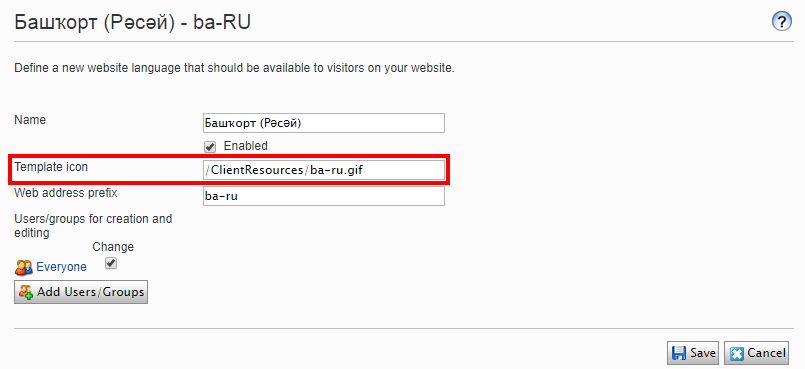
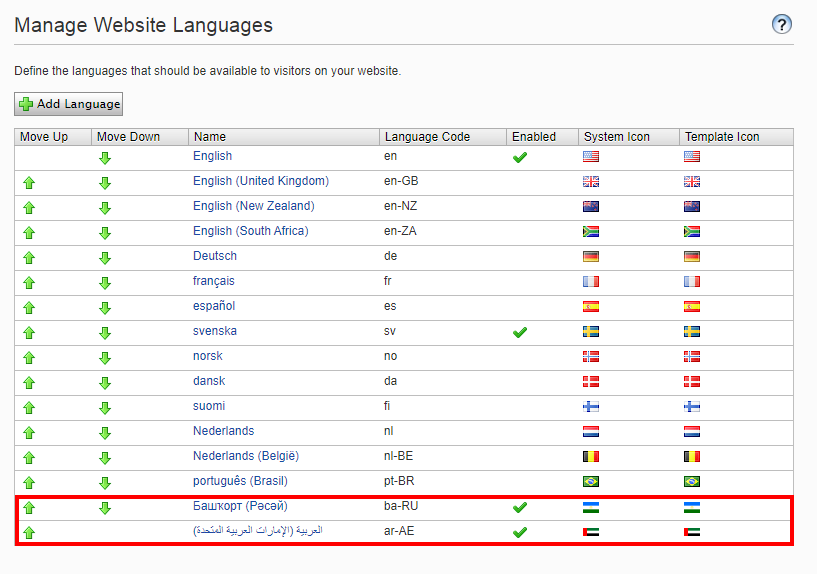

# Alloy MVC Template

## Setup the Development Environment
1. Run `setup.cmd`
2. Build the solution in Visual Studio

Once the environment is setup, you can press `CTRL-F5` in Visual Studio to start the sample site.

## Language flag configuration

Copy flag with culture name to the following directory:
`App_Themes\default\images\flags`

When setting language provide path to icon:

The flag should be available on the list:

